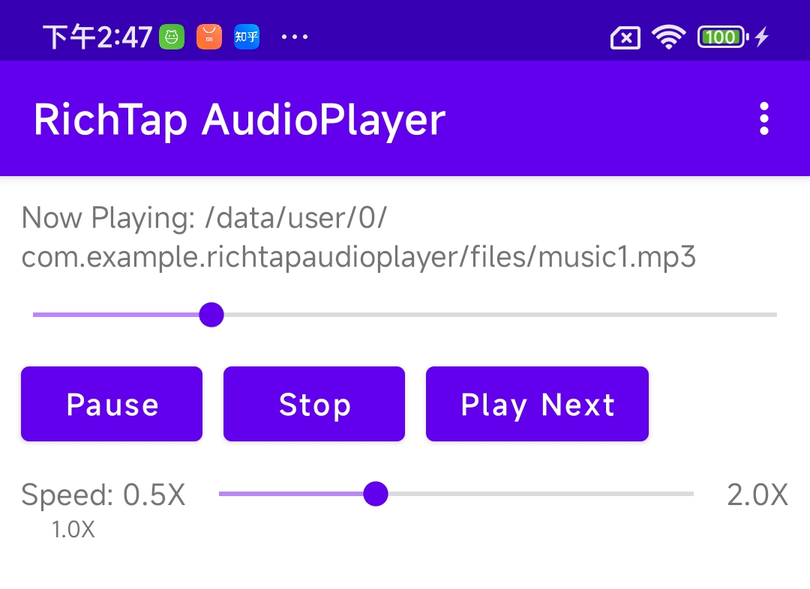

【注】需要在app\libs目录下放置完整版RichTap SDK才能编译通过。请联系service@richtap-haptics.com索取。
Please note, you need to put RichTap SDK under app\libs before compiling the codes. Please contact service@richtap-haptics.com for the SDK.

本示例演示了在音乐播放场景里，如何使用RichTap SDK进行同步的触感播放，并且演示了在程序初始化、退出、播放开始/暂停/停止/拖动播放进度条/倍速播放等情景下触感播放器的相应处理。
This sample project shows you how to use RichTap SDK to play haptic feedback during playing a music file. It also demonstrates the usage of seeking and playback speed adjustment features.

